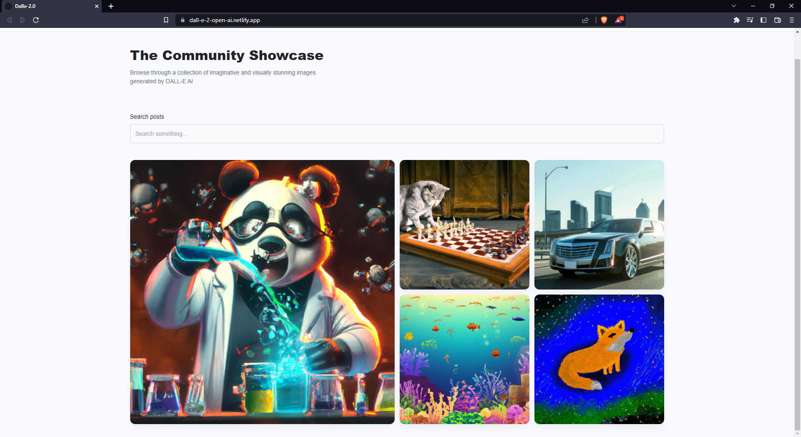

# DALL-E 2.0

### The AI image generator app features a community showcase option, allowing users to display and share their unique, AI-generated images with a thriving community of like-minded creatives.

**Link to project:** https://dall-e-2-open-ai.netlify.app/

## How It's Made:

**Tech used:** React, Vite, JavaScript, HTML, Tailwind, CSS, MongoDB, Cloudinary, OpenAI API

- I developed the app using React and Tailwind, newer technologies to me, but their intuitive design and functionality made the development process enjoyable and seamless, and I was particularly impressed by the ease of integration and utilization of Cloudinary, a new tool for me, which proved to be incredibly convenient and user-friendly.

## Optimizations

- By utilizing Cloudinary's powerful image management and optimization tools, my site is able to deliver high-quality, lightning-fast images to users, greatly improving the overall user experience. Which proved to be faster than storing the images in MongoDB, while also supporting different user's screen sizes and connection speeds.

- Future additions could be GoogleOAuth so users could have their own collection of generated images, this would also support future additions such as the ability to like a post or comment on another user's images.

- I would like to also add the ability for a user to upload a photo that could be used as a template for the image generations, similar to Lensa or something like that.
